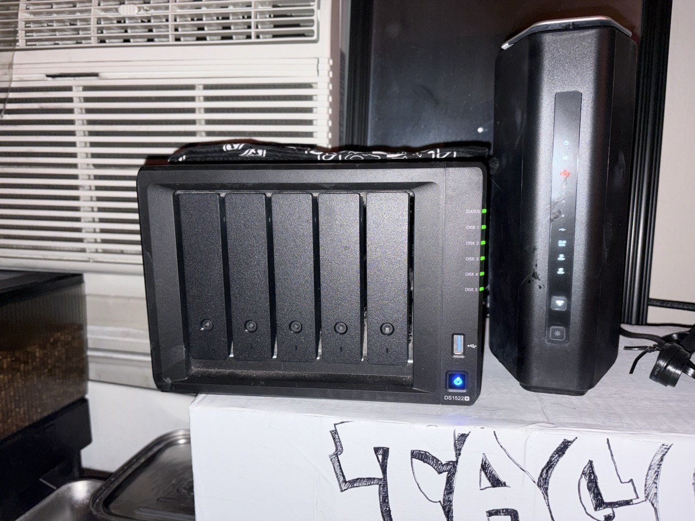

## Toop's closet

Spring cleaning resulted in a large pile of clothes I don't wear often enough. Sending them off to my parents house for ease of future travel — built this to keep track of what's there via a virtual closet inventory.

### Stack ~
- React frontend on netlify
- Serverless functions for the backend
- AWS s3 for images + inventory data
- Netlify identity for auth (just me, and maybe one other person)
- AI background remover running on my at-home synology NAS, reachable via tailscale funnel

https://github.com/user-attachments/assets/800ec3e8-679f-44b8-9caf-6ffe2413268f

---

### Background removal pipeline

Wanted clothes to look somewhat uniformed in-app, but didn't want to manually remove the background on each upload. Stumbled across **[withoutbg](https://github.com/withoutbg/withoutbg)** — an open-source ai background removal tool I was able to self-host via docker. Running it on a Synology DS1522+ NAS.

```
browser
  └─▶ netlify function (/withoutbg)
        └─▶ tailscale funnel
              └─▶ nginx proxy (secret header check)
                    └─▶ withoutbg container  ←── AI runs here, on my NAS
                          └─▶ WebP with transparent background
```


<p align="center"></p>

### NAS Exposure

withoutbg container listens on `localhost:8088` (NAS-local only). in front of it sits an **nginx proxy on port 8089** that validates a shared secret header — so random internet traffic gets a 401 before it ever touches the model.

exposing that port to the internet uses **[tailscale funnel](https://tailscale.com/kb/1223/funnel)**:

```bash
sudo tailscale serve --bg 8089
sudo tailscale funnel --bg 8089
```

the NAS is now reachable at `https://my-nas.tail******.ts.net` with TLS cert, no port forwarding, no static IP needed. the netlify function knows the URL and the secret — everything else is just HTTPS.

> images get client-side resized to ≤1500px / JPEG 0.85 before hitting the function. netlify has a 6MB body limit and a 7MB iPhone HEIC will breach it.

---

### Auth — Netlify Identity

single-user auth via **netlify identity** with JWT. The identity user → slug mapping lives in a `USERS` env var:

```
USERS=toop:abc-uuid-123,vanessa:def-uuid-456
```

Netlify functions read `context.clientContext.user` — no database needed.

### Storage — AWS s3

| path | what |
|---|---|
| `inventory/{slug}.json` | the full item list for a closet, as JSON |
| `clothing/{slug}/{uuid}` | the uploaded image |

images never pass through the netlify function. the client gets a **presigned PUT URL** (5 min TTL, content-type whitelisted to image MIME types) and uploads directly to S3. the function only generates the URL.

### Backend — Netlify Functions

| function | does what |
|---|---|
| `clothes.ts` | `GET / POST / PUT / DELETE` for the item list |
| `upload-url.ts` | issues a presigned S3 URL for image upload |
| `withoutbg.ts` | proxies binary image data to the NAS, returns WebP |
| `whoami.ts` | returns the slug for the logged-in user |

every write is auth-gated and scoped to the requesting user's slug before anything touches S3.

### Frontend — React 19 + Tailwind v4

```
src/
  App.tsx            ← root state, all business logic
  api.ts             ← single seam for all backend calls
  components/
    ClothingCard.tsx  ← card + lightbox on click
    ItemModal.tsx     ← add/edit form, image preview, remove-bg button
    CategoryFilter.tsx ← filter pills + add button
    Header.tsx
```

---

## Credits

- **[withoutbg](https://github.com/withoutbg/withoutbg)** — open-source background removal you can actually self-host. runs as a single docker container, no cloud account required.
- **[tailscale](https://tailscale.com)** — used funnel to punch the NAS through to the public internet in two commands.
